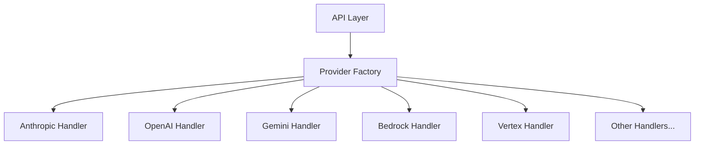
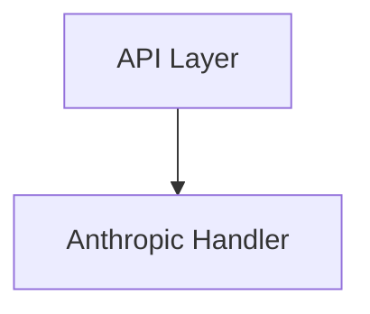
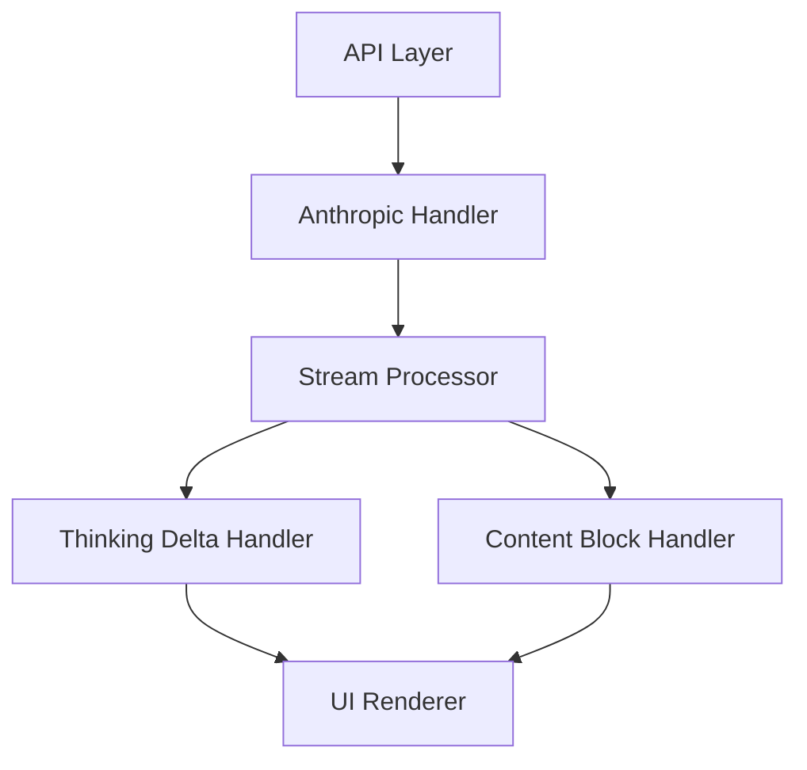
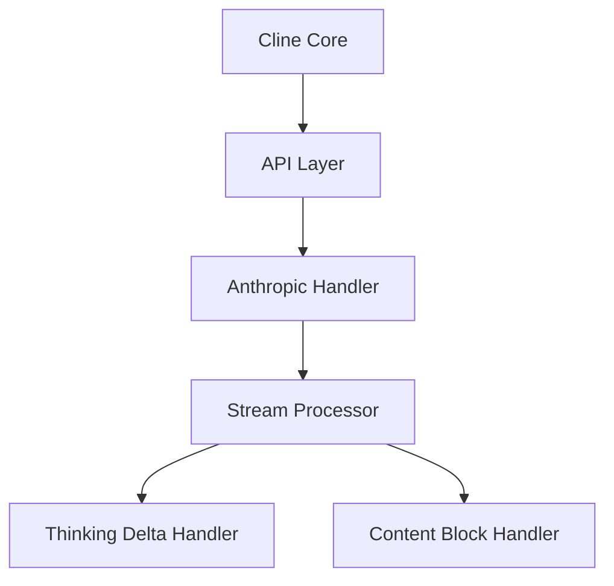
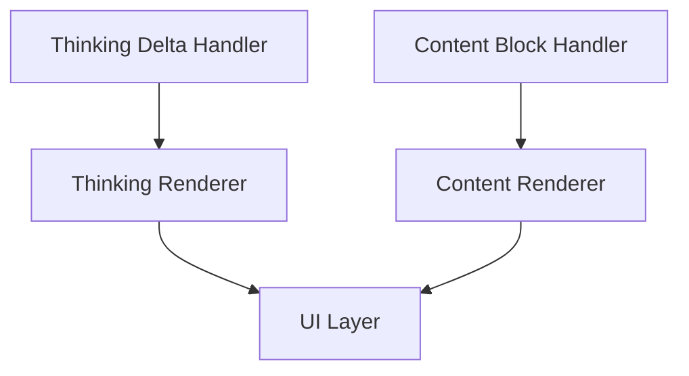
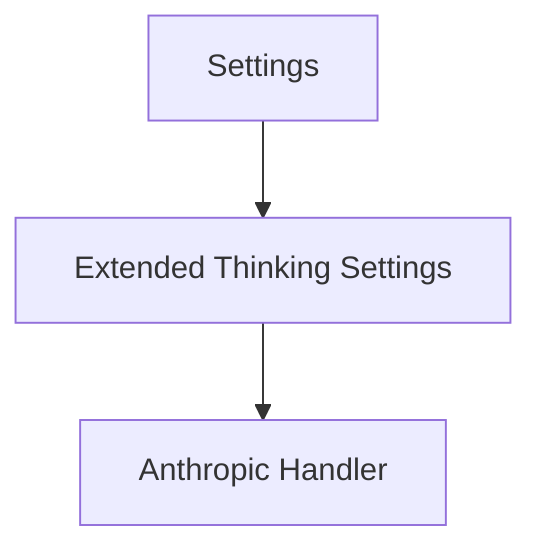
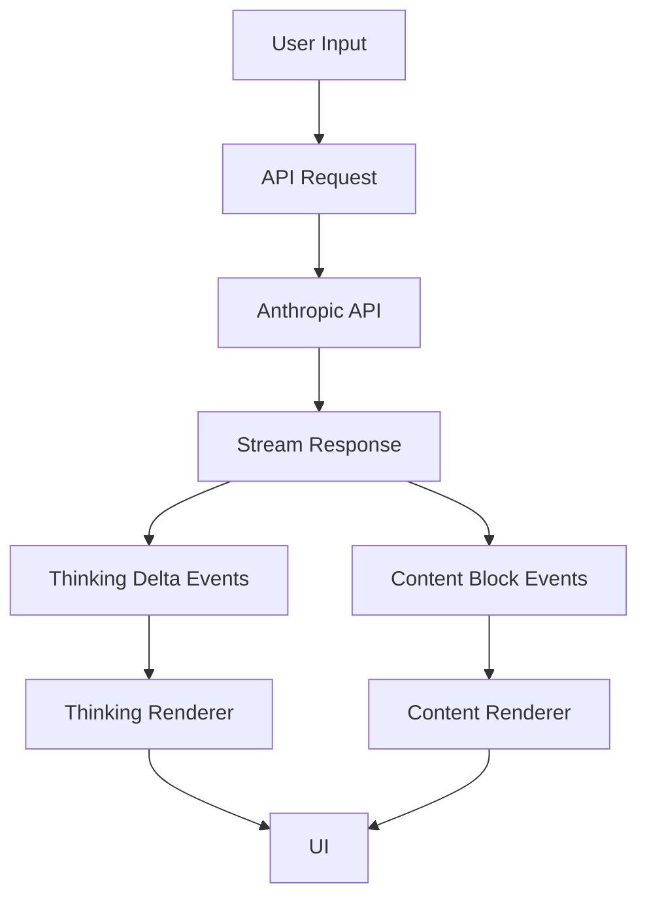
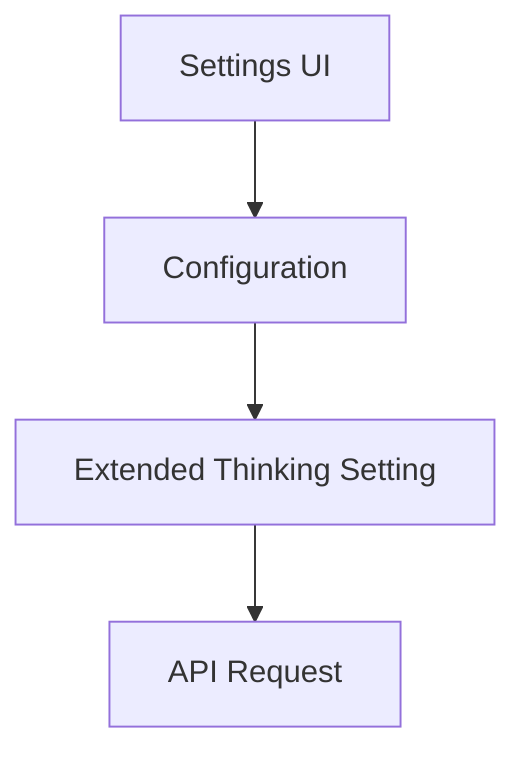

# Rich-Cline システムパターン

## システムアーキテクチャ

Rich-Clineは、元のClineアーキテクチャをベースにしながら、Anthropicに特化した最適化を施します。主要なアーキテクチャの変更点は以下の通りです：

### 1. プロバイダーアーキテクチャの簡素化

**現在のCline**:


**Rich-Cline**:


### 2. Extended Thinking統合アーキテクチャ



## 主要な技術的決定

### 1. Anthropic専用化

- **決定**: 他のプロバイダーのコードを削除し、Anthropicのみをサポート
- **理由**: コードベースの簡素化、Anthropicの特殊機能への最適化
- **影響**: UIの簡素化、設定オプションの削減、コードの保守性向上

### 2. SDKアップデート

- **決定**: @anthropic-ai/sdkを^0.37.0以上にアップデート
- **理由**: thinking_delta機能のサポート
- **影響**: ストリーミング処理の変更、UIの更新

### 3. thinking_delta統合

- **決定**: thinking_deltaイベントを処理するための新しいハンドラーを追加
- **理由**: Extended Thinking機能の活用
- **影響**: UIの更新、ストリーミング処理の変更

### 4. `<thinking>`タグの処理変更

- **決定**: `<thinking>`タグの処理を削除または修正
- **理由**: thinking_deltaによって不要になるため
- **影響**: システムプロンプトの変更、UIの更新

## コンポーネント関係

### 1. APIレイヤー



### 2. UIレイヤー



### 3. 設定レイヤー



## 設計パターン

### 1. ファクトリーパターンの簡素化

元のClineでは、様々なプロバイダーを処理するためにファクトリーパターンを使用していましたが、Rich-Clineではこれを簡素化し、Anthropicハンドラーを直接使用します。

**変更前**:
```typescript
export function buildApiHandler(configuration: ApiConfiguration): ApiHandler {
  const { apiProvider, ...options } = configuration
  switch (apiProvider) {
    case "anthropic":
      return new AnthropicHandler(options)
    case "openrouter":
      return new OpenRouterHandler(options)
    case "bedrock":
      return new AwsBedrockHandler(options)
    // ... 他のプロバイダー
    default:
      return new AnthropicHandler(options)
  }
}
```

**変更後**:
```typescript
export function buildApiHandler(configuration: ApiConfiguration): ApiHandler {
  const { ...options } = configuration
  return new AnthropicHandler(options)
}
```

### 2. ストリーミングハンドラーの拡張

Extended Thinkingのthinking_deltaイベントを処理するために、ストリーミングハンドラーを拡張します。

```typescript
async *createMessage(systemPrompt: string, messages: Anthropic.Messages.MessageParam[]): ApiStream {
  // ...
  for await (const chunk of stream) {
    switch (chunk.type) {
      case "thinking_delta":
        yield {
          type: "thinking",
          thinking: chunk.delta.thinking,
        }
        break
      // ... 他のケース
    }
  }
}
```

### 3. UIレンダリングの拡張

thinking_deltaイベントを表示するためのUIコンポーネントを追加します。

```typescript
// ThinkingRenderer.tsx
export const ThinkingRenderer: React.FC<{ thinking: string }> = ({ thinking }) => {
  return (
    <div className="thinking-container">
      <div className="thinking-header">Claude's thinking process:</div>
      <div className="thinking-content">{thinking}</div>
    </div>
  )
}
```

## データフロー

### 1. Extended Thinking有効時のデータフロー



### 2. 設定データフロー



## 移行戦略

1. **フェーズ1**: 他のプロバイダーコードの削除
2. **フェーズ2**: SDKのアップデート
3. **フェーズ3**: thinking_delta処理の追加
4. **フェーズ4**: `<thinking>`タグ処理の修正
5. **フェーズ5**: UIの最適化
